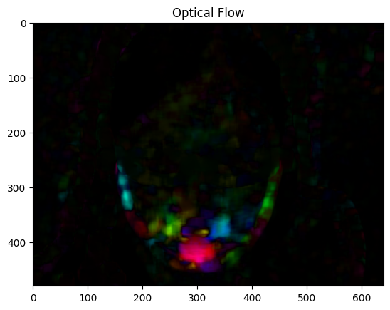

This repository contains two models to clasify microexpressions using ApexFrame.

## Dataset 

The CASME II (Chinese Academy of Sciences Micro-Expression II) dataset is one of the most widely used collections for research on micro-expressions. It consists of high-resolution recordings of facial micro-expressions, which are brief, involuntary facial movements lasting less than 1/25th of a second.

This dataset provides indexes of ApexFrames, which, in theory, are the frames that contain the most information about the expression. The process for identifying these frames is described in, for example, 'CapsuleNet for Micro-Expression Recognition'. In this project, we use the MediaPipe BlazeFace face detection model, which helps extract faces from the entire frames.

The dataset structure after preparation is shown below, with each folder containing both the ApexFrame and OnsetFrame:

prepared_dataset/
    ├── sub01/
    │   ├── ROI_EP02_01f/
    │   │   ├── onset_frame.jpg
    │   │   ├── apex_frame.jpg
    │   ├── ROI_EP02_02f/
    │   │   ├── onset_frame.jpg
    │   │   ├── apex_frame.jpg
    │   └── ...
    ├── sub02/
    │   ├── ROI_EP02_01f/
    │   │   ├── onset_frame.jpg
    │   │   ├── apex_frame.jpg
    │   └── ...
    └── ...

The model predicts microexpressions categorized into four groups. The mapping of original labels to these groups is as follows:

Positive: Includes "happiness".
Negative: Includes "disgust","fear", "repression," and "sadness."
Surprise: This category is kept separate and remains "surprise".
Other: This category includes the label "others."

## Models
 
### Optical Flow based model

In the `opticflow_net.ipynb`, this model uses optical flow (via OpenCV's calcOpticalFlowFarneback()) to capture facial movement between two frames. The flow information is then passed through a ResNet model (without the final layer) to extract features. A classifier is added to predict the micro-expression class based on these features, combining optical flow with ResNet's feature extraction for accurate prediction.

### Siamese_network based model

In the `siamese_net.ipynb`, a Siamese network is used to compare two frames. Each frame is passed through a ResNet model (without the final fully connected layer) to extract embeddings. The embeddings from both frames are then subtracted, and the resulting difference is classified into a micro-expression category. This approach helps the model focus on changes in the facial expression between the two frames.

## Results

| Model               | Accuracy     | F1 Score     |
|---------------------|--------------|--------------|
| Optical flow        | 0.686        | 0.639        |
| Siamese network     | 0.609        | 0.599        |

